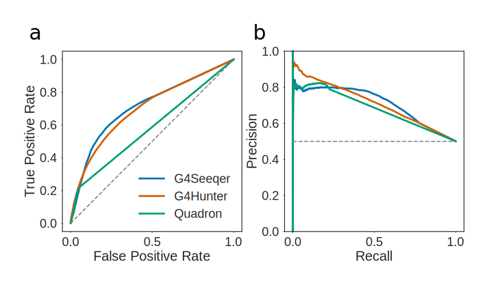

# A Recurrent Neural Network to Predict G Quadruplex Structure
\label{chap:g4seeqer}

## Introduction

Because of the dependence of G4 structure largely on sequence information, it is possible to make predictions about the propensity of specific sequences to form G4s using pattern matching analyses. The initial rule which was employed for putative G4 (PG4) detection in the human genome was the Quadparser method [@Huppert2005]. This is a simple regular expression following the pattern $G_{X}N_{1-7}G_{X}N_{1-7}G_{X}N_{1-7}G_{X}$ where $X\geqslant 3$. The Quadparser method was chosen based upon early Circular Dichroism and UV melting data, which suggested that G4s tended to be more stable with three or more tetrads, relatively short loop lengths, and no bulges in tetrads. These fairly stringent rules for formation mean that in general, the Quadparser method is considered to be fairly conservative, and misses a lot of sequences with high G4 forming potential.

More recently there has been a large increase in the number of available methods for predicting G4s [@Bedrat2016; @Hon2017; @Garant2017; @Sahakyan2017]. The contribution from Bedrat et al., named G4Hunter, is a scoring method based on a run length encoding the input sequence. Runs of Gs score positively whilst runs of Cs score negatively. It can be used with a sliding window approach to score an entire genome, with thresholding to identify high scoring PG4s. Whilst this approach is much more tolerant of imperfections which violate the Quadparser method, it is arguably too tolerant, producing many false positives. Furthermore, it does not take into account flanking A and T sequences which may contribute to the stability of the G4, e.g. through reducing the favourability of double stranded DNA.

Some middle ground is required to improve existing methods. The current global interest in machine learning for solving biological problems has recently been brought to the field of G4 research, to attempt to solve this issue. One G4 prediction tool, G4RNA screener, is a densely connected neural network which is trained on the trinucleotide contents of input sequences [@Garant2017]. This model was trained by Garant et al. using a set of melting temperatures of RNA G4s obtained from a literature search. Currently this database contains only 368 sequences, however. Given the almost inconceivable number of potential G4 forming sequences (there are more than $10^{12}$ sequences which could match the original Quadparser pattern, not including flanking sequences), it is probable that this dataset does not capture all of the variety of possible RNA G4 forming sequences. To do this, a more high throughput method for measuring G4 forming propensity is required.

A new method for sequencing of genomic G4 structures, termed G4Seq, may provide this level of throughput [@Chambers2015]. To create this dataset, Chamber et al. sequenced human genomic DNA in an Illumina sequencing-by-synthesis machine, in the presence or absence of G4 stabilising potassium cations, or G4 binding ligand Pyridostatin. The G4 structures caused stalling of DNA polymerase, resulting in a large number of errors in the resulting read. When the authors then mapped the resultant reads, the mismatch rate which occurred at each position in the genome could be counted to create a map of G4-forming loci. Another high throughput method for sequencing G4s, this time in human mRNAs, was developed by Kwok et al. This protocol utilises the ability of potassium or pyridostatin stabilised RNA G4s to stall reverse transcriptase, resulting in a drop off of reads in the 3'->5' direction in RNAseq data [@Kwok2016].

Data from the G4Seq experiment was leveraged by Sahakyan et al. to build an extreme gradient boosted machine model, named Quadron, to predict G4 formation [@Sahakyan2017]. Quadron initially predicts PG4s using the Quadparser method, but with extended loop lengths of 1-12. Various derived features, such as tetrad number, loop length and mono-, di- and trinucleotide content, are then extracted from these patterns and used to train a model predicting G4Seq mismatch rate. The primary drawback of this method is that the Quadparser method is still used to make initial predictions. This means that Quadron is only able to improve the precision of the existing Quadparser method by rejecting false positives that do not form G4s. Since the Quadparser method is already quite conservative, a lot of potential G4 forming sequences are still missed.

Here we present a new method for G4 prediction, which builds on the work of Bedrat et al. and Sahakyan et al. We use the G4Seq dataset as training data, however a convolutional and recurrent neural network is used to process input sequences directly, meaning fewer prior assumptions are required about what constitutes a G4 forming sequence. Our new method, which we name G4Seeqer, performs better on both the G4Seq datasets and other datasets, including G4s immunoprecipitated from chromatin [@Hansel2016]. We also use transfer learning to apply the model learned from G4Seq data to RNA G4 prediction. Finally, we use G4Seeqer to characterise unnoticed features of the G4Seq dataset, and compare our scores to data from UV melting experiments.

\newpage

## Materials and Methods

### G4Hunter Algorithm

The G4hunter algorithm from Bedrat et al. was reimplemented in Cython (Python superset which can be compiled to C) with some alterations [@Bedrat2016]. Input sequences were run length encoded, and each run of Gs was scored as the square of length of the run, with a maximum score per run of 16. These scores were summed to give a positive strand total score. Runs of Cs were scored equivalently but in a separate negative strand score. Scores were divided by the length of the input sequence to get a normalised score.

### Training Data Preprocessing

The modified G4Hunter method was run on the hg19 genome using a window size of 50bp, a step size of 5 and a threshold of 0.75 to generate a total of 7484506 candidate G4 intervals, which were output in bed format. Intervals were increased in size by 39bp in each direction using `bedtools slop` to introduce flanking sequence information for classification [@Quinlan2010]. Overlapping intervals were filtered using a dynamic programming technique commonly used in the field of interval scheduling. Intervals were weighted by their G4Hunter score, such that the maximum number of high scoring non-overlapping intervals was yielded.

To ground truth score these sequences, `bedtools map` was used to intersect them with the G4Seq dataset [@Chambers2015], which was downloaded from GEO (GSE63874). Bedgraph files of this data contained percentage mismatch scores for each position of the human genome at 15bp resolution. The G4Seq dataset generated in the presence of potassium was chosen as it was deemed more likely to be of biological relevance than the dataset generated in the presence of Pyridostatin, a G4-binding drug.

Intervals files and corresponding mismatch scores were read into Python using `pandas` and histograms of log transformed mismatch scores were plotted using `matplotlib` [@VanRossum1995; @Mckinney2011; @Hunter2007]. The threshold of approximately 3 for separating G4-forming and non-G4 forming sequences was chosen using `scipy` to determine the local minimum in the histogram [@Jones2001]. Joint plots of percentage mismatch score against G4Hunter score were plotted using `seaborn` [@Waskom2014].

Since positive training examples were outweighed by negative ones in this dataset by a factor of 10:1, random under-sampling of negative examples was conducted using `imblanced-learn` to attain a ratio of 2:1 [@Lemaitre2001]. This filtered dataset was shuffled and written to disk in bed format, and `bedtools getfasta` was used to extract sequences for each interval from hg19 [@Quinlan2010]. Sequences were then one hot encoded and loaded into HDF5 format for training using `h5py` [@Collette2013]. For training of models on trinucleotide content, trinucleotide content statistics were extracted and loaded into HDF5 format.

### Model Training and Validation

All models were trained in Python using `Keras` with `TensorFlow` backend [@Chollet2018; @Abadi2016]. The trinucleotide Multi-Layer Perceptron model contained three hidden layers with 16 units per layer. These were trained using the ADAM optimiser and binary crossentropy loss function, with a dropout rate of 0.2 on all layers. The convolutional portion of G4Seeqer was made up of two convolutional layers with 8 filters and kernel size of 3 and ReLu activation, followed by a maximum pooling layer with step size of 2. This was connected to a bidirectional Long Short Term Memory layer with 8 units and Tanh activation. The final hidden layer was a fully connected layer with 16 units, ReLu activation and a dropout rate of 0.5. G4Seeqer was trained using the RMSprop optimiser and binary crossentropy loss function.

All models were trained on 80% of the training data with 10% used for validation. Training was conducted for a maximum of 30 epochs, but with early stopping when the change in validation loss was less than 0.0005 for more than 3 Epochs. The Trinucleotide MLP model converged to this minimum change after 8 Epochs, whilst G4Seeqer converged after 15 Epochs.

Models were validated on 10% of the total data held out for testing purposes. Receiver Operator Characteristic (ROC) and Precision Recall (PR) curves were generated using `scikit-learn` and plotted with `matplotlib` [@Pedregosa2011; @Hunter2007]. ROC/PR curves for G4Hunter are produced using the modified method. For comparison against Quadron, the Quadron source code was downloaded from GitHub and installed [@Sahakyan2017]. Since the flanking sequences required for Quadron are longer than those used for G4Seeqer, test set sequences were increased in size by 50bp in each direction to 228bp. Sequences were extracted using `bedtools getfasta` and run through Quadron [@Quinlan2010]. For intervals which contained multiple Quadron scoring motifs, the highest score was used. For intervals which had no motifs scored by Quadron, a score of zero was assigned.

### BG4 Analysis

NarrowPeak BED files of BG4 ChIP-seq peaks were downloaded from GEO accession GSE76688 [@Hansel2016]. To accommodate Quadron's flanking sequence requirements, the size of the BG4 intervals was increased by 50bp in each direction using `awk` [@Aho1988]. A BG4-negative peak set was generated using `bedtools shuffle` [@Quinlan2010]. Shuffling was performed such that an equal number of simliarly sized intervals were selected that excluded gaps in the genome or BG4-positive peaks. Positive and negative peaks were concatenated and sequences were extracted using `bedtools getfasta` [@Quinlan2010]. Predictions were made on these sequences using G4Seeqer/G4Hunter/Quadron, and the maximum scoring interval per peak was assigned as the overall score of the peak. Where a model did not make any predictions in a peak, it was assigned a score of zero. Receiver Operator Characteristic (ROC, false positive rate plotted against true positive rate) and Precision Recall (PR, precision plotted against recall) curves were generated using `scikit-learn` and plotted with `matplotlib` [@Pedregosa2011; @Hunter2007].

### rG4seq Training Data Preprocessing

To produce training data for rG4seeqer, G4hunter windows were predicted in hg19 using a window size of 50bp and a threshold of 0.75. These were intersected with human exons using `bedtools` to get a set of 186279 putative RNA G4 forming sequences. RNA G4s identified by rG4seq in the presence of potassium [@Kwok2016] were downloaded from GSE77282 (`GSE77282_K_hits.bed.gz`), and intersected with the G4hunter windows to identify RNA G4 positive and negative examples. Of the 3383 identified RNA G4s in the rG4seq dataset, 2811 (83%) overlapped with G4hunter windows. Since the ratio of negative to positive examples was extremely high, negative examples were undersampled to a ratio of 2:1 using `imbalanced-learn` [@Lemaitre2001]. These were then shuffled and written to disk in bed format, and `bedtools getfasta` was used to extract sequences for each interval from hg19 [@Quinlan2010]. Sequences were then one hot encoded and loaded into HDF5 format for training using `h5py` [@Collette2013].

### rG4seq Transfer Learning

Model weights trained on the G4Seq dataset were reloaded in the same architecture for training on the rG4seq dataset, using `Keras` and `tensorflow` [@Chollet2018; @Abadi2016]. Weights from the initial convolutional layers were fixed (i.e. made untrainable), and only LSTM weights and final dense weights were trained. The model was trained on 6014 samples (80%), validated on 752 samples (10%), and tested on 752 samples (10%). Training was conducted as for G4Seeqer, but for a maximum of 200 epochs, with early stopping after 25 epochs if validation loss did not improve. Initial learning rate was set at 0.001 but reduced by a factor of 1/3 after 15 epochs when no reduction in validation loss was seen.

### Comparison to G4RNA Screener

Supplementary data containing 368 RNA sequences, their experimentally determined G4 forming status, and their predicted score from G4RNA Screener were downloaded [@Garant2017]. Sequences greater than 128bp were filtered to give a total of 347 sequences. Average rG4Seeqer and G4Seeqer predictions for these sequences were made by generating 1000 randomly paddings for each sequence, one hot encoding, and performing forward pass through the network. G4RNA Screener scores used in the ROC curve were taken directly from the supplemental material [@Garant2017].

### Mutation Mapping analysis

Mutation mapping was applied to human promoter regions from the ENSEMBL regulatory build [@Zerbino2015], which was originally generated using `ChromHMM` [@Ernst2017]. Promoter sequences were extracted from hg38. Mutation mapping was implemented as in Alipanahi et al. 2015: candidate sequences were edited at each position to each nucleotide, and the resulting sequences were scored for G4 formation using G4Seeqer [@Alipanahi2015]. Heatmaps were generated in Python using `seaborn` [@Waskom2014].

### G-Triplex and Hairpin analyses

G-triplex motifs were predicted in the hg19 genome using an in house script, using the pattern $G_XN_{1-4}G_XN_{1-4}G_X$ where $3 \leqslant X \leqslant 6$. Candidate triplexes which overlapped with or were contained within Quadparser motifs (pattern $G_{X}N_{1-7}G_{X}N_{1-7}G_{X}N_{1-7}G_{X}$ where $3 \leqslant X \leqslant 6$) were subtracted to produce only triplex motifs which could not form "classical" G4s. To assign mismatch scores to these sequences, they were increased in size by 50bp in each direction using `bedtools slop` [@Quinlan2010], and mismatch scores from the G4Seq dataset were mapped using `bedtools map`. Distances to next G-run were measured using Python scripts.

G-hairpin motifs were predicted in the hg19 genome using the same script, and the pattern $G_XN_{1-4}G_X$ where $4 \leqslant X \leqslant 6$. Candidate hairpins which overlapped with or were contained within Quadparser motifs or G-triplex motifs were filtered. Intervals were increased in size by 50bp in each direction using `bedtools slop` [@Quinlan2010], and mismatch scores from the G4Seq dataset were mapped using `bedtools map`. Distances to next G-hairpin were measured using `bedtools closest`. Triplex and hairpin histograms and boxplots were generated in Python using `matplotlib` and `seaborn` [@Hunter2007; @Waskom2014].

### Median model score experiments

For G4Seeqer scoring of experimentally validated G4s from Guédin et al 2010., sequences were recreated from the information in Table 1, and padded using randomly generated sequences to 128bp in length [@Guedin2010]. Left and right padding lengths were also varied at random. 1000 randomly padded sequences were generated and scored per input sequence. Scatter plots of UV melting temperature vs. median G4Seeqer score were produced using `matplotlib` [@Hunter2007]. Errorbars are 68% confidence intervals.

Synthetic sequences used for loop length and G-register experiments were 3 tetrad Quadparser conforming sequences. Each sample contained 5000 randomly generated sequences. Left and right padding sizes and nucleotide contents were varied within random samples. Loop nucleotide contents were also varied. For G-register experiments, the extra G per run was randomly assigned to either the left of right side of the G-run. Loop lengths of 3 were used. Line plots for loop length experiments were generated using `matplotlib`, and errors are 68% confidence intervals [@Hunter2007]. Boxplots were generated using `seaborn` [@Waskom2014].

### G-register Experiments

For G-register mismatch experiments, 3 tetrad Quadparser conforming G4s from the hg19 genome were identified and the corresponding mismatch score was extracted using `bedtools map` [@Quinlan2010]. The number of tetrads with G-register was counted. Boxplots were generated using `seaborn` [@Waskom2014].

### Human and Mouse G4 Subpopulation Analyses

Example Human and Mouse G4 populations were predicted in hg19 and mm10 using the Quadparser pattern with loop lengths of 3. All possible G4s conforming to this pattern were generated using python `itertools`. Venn diagrams were generated using `matplotlib_venn`. P-values were produced using hypergeometric tests. Dinucleotide complexity was defined as the total number of unique dinucleotides contained in the motif. Histograms and kernel density estimate plots were produced using `seaborn` [@Waskom2014]. For visualisation of PG4 distributions, a sample of 50000 motifs were randomly selected from the total population of all possible Quadparser motifs with loop lengths of three. These were transformed into two components using UMAP dimensionality reduction, with Hamming distance as the distance metric [@McInnes2018]. Sequences which appear in the human and mouse genome were extracted from the sample. 2D Kernel Density Estimate plots for the full sample, and hg19 and mm10 subsets, were generated using `seaborn`.

\newpage

## Results and Discussion

### Candidate G4 proposal

One major drawback to any machine learning method for G4 prediction over existing regular expression or pattern based methods is the relative expense of computation. It is therefore not sensible to train and classify a neural network model on all possible input sequences from a genome. Instead we decided to use an existing method, the G4hunter algorithm proposed by Bedrat et al. [@Bedrat2016], to produce candidate regions which could then be labelled as true positive G4s or non-G4s, and used as input for model training.

We reimplemented the G4hunter algorithm with some minor modifications [@Bedrat2016]. Bedrat et al's method run length encodes the sequence of interest and scored G-runs as the square of the run length, and C-runs as the negative of the square of the run length. These scores are then summed to give an overall score for the sequence. This method was chosen as it was assumed, based on earlier work, that a high G-content on both strands would make the G-Quadruplex unfavourable compared to double stranded DNA. Since we wished to make as few assumptions as possible, and given that the G4seq dataset stems from G4 formation in *in vitro* single stranded DNA, we altered the method to produce two scores. G runs score positively on the positive strand and C runs score positively on the negative strand. This means the sequence d(GGGCCC) would yield a high score on both strands rather than a single score of zero.

To produce candidate regions for model training, we ran the modified G4hunter method on the human genome (hg19) using a window size of 50bp, a step size of 5bp and a threshold of 0.75. Unstringent values were chosen to produce a high recall, i.e. capture as many true positive G4 structures as possible. These settings produced intervals which overlapped with all PG4 sequences predicted by the Quadparser method using maximum loop lengths of 12. It also produced significantly more sequences that did not conform to the Quadparser method, some of which are likely to form G4 structures.

### Training Data preprocessing

To created training sequences, the 50bp candidate regions from the G4hunter method were increased in size by 39bp in each direction to produce intervals of 128bp in length, since previous work has suggested that flanking regions are an important determinant of G4 stability. Clusters of overlapping intervals were filtered to produce only the interval with the highest G4Hunter score (in cases of ties, a random highest scoring interval was selected). This produced a total of 6,237,943 candidate intervals. Each candidate interval was then scored by mapping the value of the maximum scoring overlapping window from the G4seq dataset [@Chambers2015], which contains percentage mismatches (%mm) from sequencing in the presence of potassium vs. absence of potassium, in 12bp windows. Regions of high %mm on the positive strand indicate a G4 structure on the negative strand, and vice versa.

Plotting the distribution of the log of the %mm scores produced a bimodal distribution with a peak around 1 (corresponding to 2-3% mismatch) and another around 3.5 (corresponding to approximately 30% mismatch) (Fig. \ref{training_data}a). We determined the local minimum in the histogram between the two peaks to be approximately 3 (around 20% mismatch), therefore we used this value to split the data into G4 positive and G4 negative subsets. This yielded more than 10 times as many G4 negative sequences than positive, however (5,809,719 negative to 428,224 positive). Since maintaining such an imbalance in the training data would produce a poor classifier, we undersampled the G4 negative class to a ratio of 2:1, yielding a total of 1,284,672 sequences.

\newpage

![**Mismatch scores of candidate sequences identified by G4Hunter:** **a)** Histogram of log percentage mismatch score from the G4Seq dataset, for the 50bp sequences identified by G4Hunter (threshold of 0.75). Dashed line shows the threshold chosen to delimit G4 positive and G4 negative sequences. This corresponded to around 20% mismatch score. **b)** Joint plot of log mismatch score against G4Hunter score for 10000 randomly sampled sequences. Orange line shows lowess curve fit. \label{training_data}](figures/training_data_dist.svg)

\newpage

### Model selection and training

Previously published G quadruplex prediction methods which utilise machine learning techniques have used derived features such as trinucleotide content to feed to models [@Garant2017; @Sahakyan2017]. These features result in the loss of some spatial information about the sequence, however. For example, the sequence `GGTGGTGGTGGGGGG` has the same trinucleotide composition as `GGGTGGGTGGGTGGG`, but is unlikely to have equivalent G4 forming propensity. Furthermore, Quadron derived features require input sequences to conform to the QuadParser regular expression [@Huppert2005], meaning that Quadron is only able to improve the precision of the QuadParser method, and not the recall. We opted for a neural network involving convolutional layers (those often used for image classification) that could make predictions directly from the sequence itself, without any derived features whatsoever. This allows us to make no assumptions about potential G4 patterns in the dataset. The overall architecture selected was a convolutional-recurrent neural network (Fig. \ref{architecture}), which has previously been used to identify regulatory motifs in DNA [@Quang2016]. The architecture consists of two one dimensional convolutional layers with a kernel size of 3, to capture local features in the sequence. A maximum pooling layer then reduces the size of the feature space by half. These features are then fed to a bidirectional Long Short Term Memory (LSTM) layer, which is able to learn and recognise long distance relationships between features in the sequence. The model outputs a single value between zero and one of the probability of G4 formation. The dataset was split into three for training and testing: 1332565 sequences (~80%) were used for training, 166571 (~10%) for in-training model validation, and 166576 (~10%) for post-training model testing.

\newpage

![**G4Seeqer architecture** Adapted from Quang & Xie 2016. **a)** Sequences are one hot encoded to produce a matrix which can be processed by the neural network. **b)** Input matrices are passed through a convolutional layer. Each layer contains 8 filters which are trained to recognise local patterns on the scale of 3-6bp in size. **c)** Convolutional features are passed through a bidirectional Long Short Term Memory (LSTM) layer. This layer recognises long distance interactions between features which might combine to produce G4s. **d)** Finally, features are passed through a fully connected layer. Output from the model is a single probability of whether the sequence forms a G4. \label{architecture}](figures/architecture.svg)

\newpage

### Comparison to existing methods

We benchmarked our technique (hereafter referred to as G4Seeqer) using the 10% of the data reserved for testing. The model was compared to our modified G4Hunter method, as well as a multi-layer perceptron model trained on trinucleotide frequencies derived from the same dataset as was used to train G4Seeqer. This model allows us to compare the methodology of G4RNA Screener [@Garant2017] to our own method, since G4RNA Screener was originally trained on a database of RNA G Quadruplexes, and may not perform as well on a dataset derived from DNA. The performance of the methods were calculated using the Receiver Operating Characteristic area under curve (ROC AUC). We found that neither G4Hunter [@Bedrat2016] nor the G4RNA-like method performed as well as G4Seeqer on the test dataset (AUC G4Hunter 0.82, G4RNA Screener-like 0.90, G4Seeqer 0.94) (Fig. \ref{roc}a-b). This is likely due to the loss of sequence spatial information in the former methods.

To benchmark our method against the other G4Seq trained machine learning G4 prediction package, Quadron, we downloaded and installed the Quadron source code [@Sahakyan2017]. Quadron was used to score sequences from the held out test set and compared to the performance of other methods. Quadron requires larger flanking regions of 50bp, so test set intervals and sequences were increased in length by 50bp in both directions to produce test sequences of length 228. This was deemed the best way to compare the two methods, however was still not ideal since Quadron may have been trained on some or all of the test sequences. Regions which had predictions associated with them by G4Hunter and G4Seeqer but had no associated predictions from Quadron (due to not conforming to the Quadparser regular expression) were given a Quadron score of zero. The ROC curve of Quadron (AUC 0.7) ((Fig. \ref{roc}a-b)) had interesting properties: the model is capable of producing a true positive rate of around 30% with a false positive rate of less than 1%, however shortly beyond this point in the ROC curve the curve becomes linear. This is because Quadron is only capable of scoring sequences which conform to the Quadparser method, with all other sequences being scored zero. Since these sequences only account for a 25% of all the potential PG4 forming sequences in the test set, the model does not perform well on the full dataset. Because it makes no assumptions about the input sequence, G4Seeqer is able to make accurate predictions for all forms of PG4 in the test data, as reflected in the ROC curve.

We were interested in how G4Seeqer compared against Quadron on only sequences which conformed to the Quadparser motif. We therefore filtered our dataset for intervals on which Quadron had made a prediction, and replotted the ROC curves and Precision Recall curves for the filtered data (Fig. \ref{roc}c-d). As expected the AUC for Quadron was much better on this filtered set (AUC 0.93), however it was still outperformed by G4Seeqer (AUC 0.94), suggesting that G4Seeqer captures the same or more explanatory information directly from the input sequence.

\newpage

![**Validation curves for G4Seeqer method** **a)** Receiver Operator Characteristic (ROC) curve showing the performance of G4Seeqer, Multi-Layer Perceptron (MLP) trained on trinucleotide contents, Quadron, a Gradient Boosted Machine model (Sahakyan et al. 2017) and the G4Hunter method (Bedrat et al. 2016), on a held out test set of the G4Seq dataset (10% of total dataset). **b)** Precision-recall curves showing the performance of G4Seeqer, trinucleotide MLP, Quadron, and G4Hunter on the same dataset. **c)** ROC curve and **d)** Precision Recall curve showing the performance on sequences from the test set conforming to the Quadparser motif. \label{roc}](figures/test_set_roc_pr.svg)

\newpage

### BG4 ChIP-seq data evaluation

Further model validation was performed on G4s experimentally validated by an entirely different technique, namely G4-chromatin immunoprecipitation (BG4) [@Hansel2016]. The BG4 dataset is arguably more biologically relevant than G4seq since G4 structures are not induced by addition of potassium, and are captured from native chromatin. BG4 peak intervals were shuffled to produce a set of G4 negative sequences, and then the performance of the models was evaluated on the real and shuffled peaks. For each BG4 interval, the highest scoring overlapping prediction for each model was assigned. Any intervals with no overlapping predictions were scored zero for that model. We tested the G4Seeqer, G4Hunter and Quadron methods. As with the G4Seq test dataset, we found that Quadron performed reasonably for Quadparser conforming BG4 peaks, but was unable to identify most of the true positive BG4 peaks due to its restriction to the pattern. G4Seeqer performed better on all BG4 peaks, with an AUC of 0.71, however was only marginally better than the G4Hunter technique (AUC 0.7) (Fig. \ref{bg4}). These results suggest that the information within the G4Seq dataset, when captured by a suitable model, is predictive of G4s in an *in vivo* setting.

\newpage

\newpage

### Transfer learning on RNA G4Seq (rG4seq) Dataset

PG4s with the same sequence are likely to have slightly different G4 forming potentials in DNA and RNA, due to the chemical differences in these molecules. The sugars which make up the backbone of RNA are riboses, which have an extra 2' hydroxyl group compared to the deoxyribose found in DNA. This extra hydroxyl group is thought to have a number of implications for G4 formation: it increases the number of backbone hydrogen bonds in the G4, increasing its enthalpic favourability and its entropic favourability (by reducing the number of coordinated water molecules) [@Collie2010]. Furthermore, the 2' hydroxyl introduces steric constraints which make parallel RNA G4s much more favourable than anti-parallel ones [@Collie2010]. Given these differences, it is likely therefore that a model specifically trained on DNA G4 sequences will not perform optimally on RNA G4s.

To address this issue, we decided to retrain G4Seeqer using the rG4seq dataset produced by Kwok et al. 2016, to create an rG4Seeqer model [@Kwok2016]. Data was prepared similarly to the data for G4Seeqer: candidate regions were selected from human exonic sequences using G4hunter with window size of 50bp and a threshold of 0.75. This yielded a set of 186279 putative RNA G4 forming sequences, which were increased by 39bp in each direction to get flanking sequences. These were then intersected with rG4seq hits collected under potassium stabilising conditions (Kwok et al. 2016). Of the 3383 identified RNA G4s in the rG4seq dataset, 2811 (83%) overlapped with G4hunter windows. rG4seq negative examples were undersampled with a ratio of 2:1 to yield 7518 training samples. 80% of these were used for training, with 10% for validation and 10% held out for testing.

Because of the significantly smaller size of the rG4seq derived training set, we found that the method for training which yielded most optimal results was transfer learning from the G4Seeqer model. Weights of the initial convolutional feature extraction layers were therefore held constant, and only the weights of the LSTM layers (which find long range interactions) and dense output layers were retrained.

Testing was first conducted on the held out set of 752 sequences using G4Hunter, G4Seeqer and the newly trained rG4Seeqer. G4Seeqer significantly outperformed G4Hunter (AUC 0.9 vs 0.83 respectively), suggesting that the information extracted from the G4Seq dataset is applicable to the rG4seq dataset (Figure \ref{rG4seeqer_test}). rG4Seeqer outperformed both methods, however (AUC 0.95), demonstrating that domain specific information is better for predicting RNA G4s in the rG4seq dataset (Figure \ref{rG4seeqer_test}).

\newpage

\newpage

We sought to test rG4Seeqer on G4s identified by a variety of physical methods, using the set of RNA G4s curated by Garant et al. for their model, G4RNA Screener [@Garant2017]. We used 347 sequences from this dataset, of which 169 sequences were G4 positive and 178 were G4 negative. G4Seeqer and rG4Seeqer predictions were calculated by padding with random sequences to a length of 128bp before one hot encoding. This was conducted 1000 times for each sequence and the mean score was taken. G4RNA screener scores were taken directly from the supplemental information of Garant et al. 2017. G4RNA screener was found to perform best on the dataset (AUC 0.91), perhaps unsurprisingly since it was trained directly on the sequences. Perhaps more importantly, rG4Seeqer significantly outperformed G4Seeqer on the dataset (AUC 0.89 vs 0.82), showing that the rG4seq trained model generalises better to RNA G4 sequences than the G4seq trained model.

\newpage

\newpage

### Interpreting G4Seeqer output using Mutation Mapping

One common complaint about machine learning techniques is that the complexity of the models they produce make them "black boxes" which are impossible for humans to understand or extract useful knowledge or rules from. It is possible, however, to visualise some of the output of a neural network through various means. One commonly used method for interpretation is the "saliency" of the network, which can produce heatmaps showing the attention of the network to specific regions of the input image or sequence. This can be used to determine the important aspects of the input in classification. For biological sequences, previous studies have used similar methods, called "Mutation Maps", to analyse the importance of individual nucleotide positions on convolutional neural network model predictions [@Alipanahi2015; @Quang2016]. Simply, the importance of each particular nucleotide is evaluated by replacing it with each of the other three bases, and calculating the change in model score. This is then used to build a heatmap which can be used to visualise the importance of each position.

Previous studies have highlighted a possible role for G4 forming sequences in promoters, with G4 formation tending to have a positive effect on expression, particularly in proto-oncogenes [@Eddy2006; @Hansel2016]. We therefore decided to use the mutation map approach to characterise PG4s in promoter regions extracted from the ENSEMBL regulatory build [@Zerbino2015]. Promoter sequences were screened using G4Seeqer and single base mutation maps were created for each candidate PG4, including those regions where the neural network score was low. Unsurprisingly, all of the most deleterious single base substitutions (causing a score reduction of more than 0.9) predicted by G4Seeqer mutation mapping were G->H changes.

We identified PG4 sequences scoring more than 0.9 for which a single G->H change resulted in a reduction of as much as 0.9 in score (i.e. switched the score from strongly PG4 positive to strongly PG4 negative) (Fig. \ref{triplex}a). Analysis of the mutation maps for these sequences showed that the majority of contained regions containing three G-runs with short connecting loops. These tended to have a long final loop to the next homopolymeric G-run, or no final G-run within the window size. Any G->H mutation in these G-dense regions strongly affected the predicted G4 forming ability. Recent work by Hou et al. has shown that formation of G4 structures in human telomeric sequences occurs via a stable G-triplex structure [@Hou2017]. We believe these results suggest that the G4seq dataset is either capturing mismatches caused by G-triplex structures, or by G-quadruplexes formed from short range G-triplex interaction with more long range single G-runs. To further illustrate this we predicted all short looped (1-4bp) G-triplexes in the human genome which did not overlap with a Quadparser predicted PG4 (loop lengths 1-12bp). We found that 35% of these were associated with a %mm score greater than 20%, suggesting the formation of some secondary structure (Fig. \ref{triplex}b). To see if medium range G-run interactions might stabilise these, we then measured, for each G-triplex, the distance to the next run of at least three Gs on the same strand, and compared this to the %mm score. We found a negative correlation between distance and %mm score (Spearmans rho -0.2) for G triplexes with a G-run less than 100bp away, suggesting that these longer range interactions do occur but become weaker with distance (Fig. \ref{triplex}c). This could be due to a reduction in G4 stability with loop length, but could equally be explained by a reduction in the likelihood of the next G-run being contained in the same sequenced fragment. No clear difference was observed in the correlation of %mm score with upstream or downstream G-runs (Spearmans rho -0.17 and -0.15 respectively) suggesting there is no preference for the long loop region to be at the 5' or 3' of the G triplex.

\newpage

![**Identification of G-triplex structures by G4Seeqer Mutation Maps** **a)** Mutation map showing the a high scoring (0.99) G4Seeqer motif which may form a G-triplex. Mutation of any base in the central G-run of the motif is sufficient to reduce the score by up to 80%. **b)** Histogram of log percentage mismatch score for motifs conforming to a G-triplex like pattern. The bimodal distribution suggests that many of these motifs form structures which disrupt polymerase in the presence of potassium. **c)** Boxplot showing the relationship between %mm score and distance to next G-run in G-triplex structures. The negative correlation suggests G-triplexes might recruit distant G-runs to form G4s. \label{triplex}](figures/g_triplex.svg)

\newpage

We also noted that G4Seeqer was positively labelling certain sequences which contained only two G-runs, usually of greater than 4 bases in length (Fig. \ref{hairpin}a). These scores were also very sensitive to G->H mutations. Based on the folding dynamics work by Hou et al, we hypothesised that these sequences might form G-hairpins, which could associate with other nearby hairpins to form G4 structures [@Hou2017]. To test this, G-hairpins with G-run lengths greater than four were predicted and filtered to remove any overlaps with predicted QuadParser G4s (loop length 1-12) or G-triplexes (loop length 1-4). 27% of these sequences had %mm scores greater than 20% (Fig. \ref{hairpin}b). For each predicted G-hairpin, the distance to the nearest G-hairpin was calculated and correlated with %mm. Again, distance was found to correlate negatively with %mm score (Spearmans rho -0.18), suggesting that these hairpins may associate with each other to form G4s (Fig. \ref{hairpin}c).

\newpage

![**Identification of G-hairpin structures by G4Seeqer Mutation Maps** **a)** Mutation map showing the a high scoring (0.99) G4Seeqer motif which may form a G-hairpin. Mutation of any base in the core motif is sufficient to reduce the score by up to 80%. **b)** Histogram of log percentage mismatch score for motifs conforming to a G-hairpin like pattern. The bimodal distribution suggests that many of these motifs form structures which disrupt polymerase in the presence of potassium. **c)** Boxplot showing the relationship between %mm score and distance to next G-hairpin for G-hairpin structures. The negative correlation suggests G-hairpins might interact with other relatively distant hairpins to form G4s. \label{hairpin}](figures/g_hairpin.svg)

\newpage

In order to study how interactions between pairs mutations might affect predicted G4 stability, we developed a pairwise mutation map, in which pairs of Gs in each sequence were combinatorially mutated to Ts. We then analysed the resultant mutation maps to identify pairs of G->T transversions which interact to reduce predicted G4 forming potential more strongly than each individual mutation. Perhaps unsurprisingly, we found that in sequences which had more than four G-runs, or had G4s containing features which might form G-triplexes or G-hairpins, mutations which disrupted peripheral G-runs did not have a strong effect on predicted stability. Combinations of mutations which disrupt multiple G-runs had a much stronger effect on stability, however.

### Loop Length and G4 stability

To determine whether G4Seeqer probability scores supported previous work on the relationship between G4 loop length and stability, we first downloaded UV melting temperatures for three tetrad G4 sequences from Table 1 of Guédin et al. 2010. The majority of these G4 sequences contain only runs of Gs and Ts. In each experiment, one or two of the three T loops were held at a constant length of either 1 or 3, and the other loops varied from 1 up to 15 bp in length [@Guedin2010]. For each sequence, we produced 1000 sequences padded to 128bp (the input length of G4Seeqer) using randomly generated bases, and used G4Seeqer to predict the stability. We found a very strong correlation (Spearmans rho 0.93, p = 1.1e-35) between empirically determined melting temperature in potassium, and G4Seeqer score (Fig. \ref{tm}), suggesting that G4Seeqer is successfully capturing information about G4 structure which is transferable between conditions. The midpoint of the curve appears to suggest that a melting temperature of around 65 degrees Celsius is required for significant mismatches to occur in the G4Seq dataset. We also noted that G4seeqer output was more variable for sequences with lower melting temperatures, suggesting that sequence context may be more important for these G4s.

\newpage

\newpage

We next performed a similar *in silico* experiment to that of Guédin et al., whereby we generated random QuadParser conforming G4 sequences with two loop lengths held at 1bp and the third varied from 1-60bp. Loop regions were constructed by randomly selecting from A C or T. The G4Seeqer score for these sequences was then generated. Unsurprisingly, we found that G4Seeqer score reduced with increasing loop length. This effect was strongest for the central loop of the G4, presumably because varying this loop has a greater effect on the ability to form stable G-triplex intermediates (Fig. \ref{loop_len}a). We then set the length of the non-varying loops to 3bp and re-ran the analysis for third loop length 1-60bp. For these PG4s, we found that the probability of G4 prediction was much more sensitive to longer loop lengths (Fig \ref{loop_len)c). There was also no longer a strong difference in prediction when varying the central loop, compared to either loops 1 or 3, possibly suggesting that triplex formation in these sequences is less common.

\newpage

\newpage

### Effect of G-register on G4 stability

Work by Harkness and Mittermaier has indicated that extra Guanines in some G-runs of a G4 forming sequence might increase the G4 forming potential of the sequence, by allowing exchange between different G4 conformations [@Harkness2016]. They termed this effect G-register. We analysed the G4seq dataset and the G4Seeqer model outputs to determine whether there was evidence of a relationship between stability and G-register. Firstly, for all PG4s in the human genome conforming to the three tetrad Quadparser motif, we counted the number of G-runs which contained four Gs rather than three. These motifs were then intersected with the G4seq dataset to identify the %mm score. We found that G4seq motifs with greater G-register indeed tend to have higher mismatch scores (Fig. \ref{register}b). To test whether G4seeqer had successfully identified this pattern, we then randomly generated three tetrad PG4 sequences with loop lengths of 3bp, and introduced addition guanines to increase the G-register. Higher G-register strongly increased the G4Seeqer score of the sequence, showing that the model has successfully learned this feature of G4s (Fig. \ref{register}a).

\newpage

\newpage

### Applicability of the model to other genomes

Whilst the Human genome contains a large number of G4 forming sequences, this is not even close to saturating the population of all potential G4s. Indeed, simply considering the Quadparser motif with loop lengths up to 12, there are $1.1\times10^{22}$ different conforming sequences, many orders of magnitude more than there are bases in the human genome. It is probable that the human genome contains a biased subpopulation of all G4s. This might mean that the G4Seeqer model does not generalise well to other genomes which contain different subpopulations. As an example, we analysed 3 tetrad Quadparser motifs from hg19, where all three loops were of length 3. There are $4^9$ (262144) possible sequences fitting this description, of which only 1.4% (3748) appear in hg19 (Fig. \ref{g4_space}a). The motifs that did appear tended to be those with lower complexity, as measured by the number of distinct dinucleotides in the sequence, than the total possible population (Fig. \ref{g4_space}b). The PG4 space of the *M. musculus* genome was also measured, and found to contain 1.7% (4330) of all possible 3 tetrad PG4s with loop length 3. There was a strong overlap of 27% (p < 2.2e-308) between sequences in the human and mouse genomes, however, suggesting that at least for this pattern, the PG4 populations of these genomes are comparable. The more complex the PG4 motifs become, however, the more likely it is that these subpopulations will be very different. There are clear differences in dinucleotide content between different genomes, which are often a result of differences in amino acid composition of proteins, or other environmental factors such as temperature. For genomes whose last common ancestor with *Homo sapiens* was longer ago, this divergence may be much greater. These systemic differences between may result in patterns to which the model has not previously been exposed, and reduce the performance of the model. G4Seeqer, or any other models which are trained on sequences from a single genome, should therefore be used with caution on others.

\newpage

![**Human and mouse genomes contain different G4 subpopulations** **a)** Venn diagram showing overlap of 3 tetrad Quadparser motifs populations with loop lengths of 3bp in the human (hg19) and mouse (mm10) genomes, compared to all possible sequences. **b)** Histogram and kernel density estimate of dinucleotide complexity for human, mouse and all possible 3 tetrad Quadparser motifs with loop length of 3bp. **c)** 2D Kernel density estimate plot showing distribution of all possible  tetrad Quadparser motifs (left), those found in the human genome (centre) and those found in the mouse genome. Dimensionality reduction was conducted using UMAP with Hamming distance as the metric. \label{g4_space}](figures/g4_space.svg)

\newpage

### Conclusion

We present G4Seeqer, the first Convolutional/Recurrent Neural Network model for prediction of G Quadruplex forming structures. G4Seeqer is implemented in Python, using Cython for speed-up of G4Hunter candidate region proposal, and `Keras` with `Tensorflow` backend for neural network prediction [@Chollet2018; @Abadi2016]. Weights have been trained on the G4Seq dataset [@Chambers2015] and transfer learned to the rG4Seq dataset [@Kwok2016], to produce models tailored for DNA and RNA G4s, respectively. It is able to process the whole human genome in approximately 1 hour on a 8 core i7 desktop computer with 16GB RAM. Because G4Seeqer is trained directly upon sequences from the human genome, rather than on derived sequence features, it is able to identify patterns in the G4Seq dataset that have not previously been reported, as well as removing false positive sequences which are flagged by pattern matching techniques. This greatly improves the accuracy of the model on various *in vitro* and *in vivo* datasets, from stabilities determined by UV melting to genomic regions identified by BG4 ChIP-seq [@Hansel2016].

\newpage
<!--stackedit_data:
eyJkaXNjdXNzaW9ucyI6eyJHdWtoM3JqY3h3dWhXSHRpIjp7In
N0YXJ0IjoxNTYwLCJlbmQiOjE1OTAsInRleHQiOiJwcm9kdWNp
bmcgbWFueSBmYWxzZSBwb3NpdGl2ZXMifSwiV0RDM1lpQXdsak
VxVERkVyI6eyJzdGFydCI6NDY2OCwiZW5kIjo0NzIwLCJ0ZXh0
IjoiaG93ZXZlciBhIGNvbnZvbHV0aW9uYWwgYW5kIHJlY3Vycm
VudCBuZXVyYWwgbmV0d29yayJ9LCJBcFBuMFVBS1JzRTFtMXFj
Ijp7InN0YXJ0Ijo2MjQ3LCJlbmQiOjYzNzEsInRleHQiOiJPdm
VybGFwcGluZyBpbnRlcnZhbHMgd2VyZSBmaWx0ZXJlZCB1c2lu
ZyBhIGR5bmFtaWMgcHJvZ3JhbW1pbmcgdGVjaG5pcXVlIGNvbW
1v4oCmIn0sIm1qdmM3VkdFSDcxNzdUbm0iOnsic3RhcnQiOjg0
OTAsImVuZCI6ODc4MiwidGV4dCI6IlRoZSBjb252b2x1dGlvbm
FsIHBvcnRpb24gb2YgRzRTZWVxZXIgd2FzIG1hZGUgdXAgb2Yg
dHdvIGNvbnZvbHV0aW9uYWwgbGF5ZXJzIHfigKYifSwidTBsSG
I3OVdhbkhnTFJMbiI6eyJzdGFydCI6OTIzNiwiZW5kIjo5MjM5
LCJ0ZXh0IjoiTUxQIn0sInI4VmllTzdnUEM5dUhNYjAiOnsic3
RhcnQiOjEwOTE2LCJlbmQiOjEwOTI4LCJ0ZXh0IjoiaW50ZXJ2
YWwgcGVyIn0sImlZRml4Wk9mMGJLcnJSZE4iOnsic3RhcnQiOj
ExODM3LCJlbmQiOjExOTM1LCJ0ZXh0IjoiT2YgdGhlIDMzODMg
aWRlbnRpZmllZCBSTkEgRzRzIGluIHRoZSByRzRzZXEgZGF0YX
NldCwgMjgxMSAoODMlKSBvdmVybGFwcGVkIHdpdOKApiJ9LCJC
aG5PNU8wUHB5SlJGRXNFIjp7InN0YXJ0Ijo3OTEyLCJlbmQiOj
c5MjcsInRleHQiOiJvbmUgaG90IGVuY29kZWQifSwiU0JQZk5v
RXRLeWNBcExiRiI6eyJzdGFydCI6MTM3NTIsImVuZCI6MTM4MT
ksInRleHQiOiJhcHBsaWVkIHRvIGh1bWFuIHByb21vdGVyIHJl
Z2lvbnMgZnJvbSB0aGUgRU5TRU1CTCByZWd1bGF0b3J5IGJ1aW
xkIn0sIm9vVjdHcGExaTFHdUZieXIiOnsic3RhcnQiOjE0OTM5
LCJlbmQiOjE0OTU0LCJ0ZXh0IjoiUHl0aG9uIHNjcmlwdHMuIn
0sIlJOcloyTVRJWW9OVlhib3oiOnsic3RhcnQiOjE1NzY1LCJl
bmQiOjE1ODE1LCJ0ZXh0IjoicGFkZGVkIHVzaW5nIHJhbmRvbW
x5IGdlbmVyYXRlZCBzZXF1ZW5jZXMgdG8gMTI4YnAifSwiUHFQ
YnlNODlYc2dGejFqVSI6eyJzdGFydCI6MTYwOTEsImVuZCI6MT
YxMzAsInRleHQiOiJFcnJvcmJhcnMgYXJlIDY4JSBjb25maWRl
bmNlIGludGVydmFscy4ifSwiYkxQYk13eXNZeldPV2VMaiI6ey
JzdGFydCI6MTYyNjksImVuZCI6MTYzMDMsInRleHQiOiI1MDAw
IHJhbmRvbWx5IGdlbmVyYXRlZCBzZXF1ZW5jZXMuIn0sIkI2Yn
dIS0NUSzRmV0hLeVoiOnsic3RhcnQiOjE2NjYzLCJlbmQiOjE2
Njk2LCJ0ZXh0IjoicnMgYXJlIDY4JSBjb25maWRlbmNlIGludG
VydmFscyBbIn0sIm5OMW83cEx4UzlqS0QzS3IiOnsic3RhcnQi
OjE3MDE4LCJlbmQiOjE3MDQwLCJ0ZXh0IjoiRy1yZWdpc3Rlci
B3YXMgY291bnRlZCJ9LCJ1dTByUlY3azFwTlNvWXNGIjp7InN0
YXJ0IjoxODUyMCwiZW5kIjoxODc1OCwidGV4dCI6Ikluc3RlYW
Qgd2UgZGVjaWRlZCB0byB1c2UgYW4gZXhpc3RpbmcgbWV0aG9k
LCB0aGUgRzRodW50ZXIgYWxnb3JpdGhtIHByb3Bvc2VkIGLigK
YifSwieHpTWkswMEFxSlQxc0JUeiI6eyJzdGFydCI6MTkyNzEs
ImVuZCI6MTk0NjMsInRleHQiOiJTaW5jZSB3ZSB3aXNoZWQgdG
8gbWFrZSBhcyBmZXcgYXNzdW1wdGlvbnMgYXMgcG9zc2libGUs
IGFuZCBnaXZlbiB0aGF0IHRoZSBHNHNl4oCmIn0sIkJwbWxSR2
Fsd0tHclBTZ2giOnsic3RhcnQiOjIwMTIzLCJlbmQiOjIwMjYy
LCJ0ZXh0IjoidCBhbHNvIHByb2R1Y2VkIHNpZ25pZmljYW50bH
kgbW9yZSBzZXF1ZW5jZXMgdGhhdCBkaWQgbm90IGNvbmZvcm0g
dG8gdGhlIFF1YWRwYeKApiJ9LCJBSXFtc3dGVkJ6eURYRXhGIj
p7InN0YXJ0IjoyMDc3NCwiZW5kIjoyMDc4MywidGV4dCI6IjYs
MjM3LDk0MyJ9LCJEaEJxYlJTbmI0c2ZuM1gyIjp7InN0YXJ0Ij
oyMTc1OCwiZW5kIjoyMTk0NSwidGV4dCI6IlNpbmNlIG1haW50
YWluaW5nIHN1Y2ggYW4gaW1iYWxhbmNlIGluIHRoZSB0cmFpbm
luZyBkYXRhIHdvdWxkIHByb2R1Y2UgYSBwb29yIGPigKYifX0s
ImNvbW1lbnRzIjp7IjZseFpiZEswQTV6OHFaeGsiOnsiZGlzY3
Vzc2lvbklkIjoiR3VraDNyamN4d3VoV0h0aSIsInN1YiI6IjEw
MjIwNTc5NzI3Njk0MTAxMDY3NyIsInRleHQiOiJIb3cgbWFueS
BmYWxzZSBwb3NpdGl2ZXM/IiwiY3JlYXRlZCI6MTUzMjUxODU3
MjExMX0sInFaeDRvNjZYcEtuSFZFVVciOnsiZGlzY3Vzc2lvbk
lkIjoiV0RDM1lpQXdsakVxVERkVyIsInN1YiI6IjEwMjIwNTc5
NzI3Njk0MTAxMDY3NyIsInRleHQiOiJXaGF0IGlzIGEgY29udm
9sdXRpb25hbCBhbmQgcmVjdXJyZW50IG5ldXJhbCBuZXR3b3Jr
PyBIb3cgZG9lcyBpdCB3b3JrPyBIb3cgaXMgaXQgZGlmZmVyZW
50IGZyb20gb3RoZXIgbWFjaGluZSBsZWFybmluZyBhbGdvcyBv
ciBvdGhlciBOTnM/IFxuXG5XaHkgZGlkIHlvdSBjaG9vc2UgdG
8gdXNlIGEgQ1JOTj8iLCJjcmVhdGVkIjoxNTMyNTE5MjE1MzEz
fSwiakhNOXhsYlYzTTliNURQaCI6eyJkaXNjdXNzaW9uSWQiOi
JXREMzWWlBd2xqRXFURGRXIiwic3ViIjoiMTAyMjA1Nzk3Mjc2
OTQxMDEwNjc3IiwidGV4dCI6IkFsbW9zdCBjZXJ0YWlubHkgeW
91ciBhdWRpZW5jZSB3aWxsIG5vdCBiZSBhIG1hY2hpbmUgbGVh
cm5pbmcgZXhwZXJ0LiBZb3UgbmVlZCB0byBleHBsYWluIHRoZS
BtZXRob2QsIGFuZCB3aHkgeW91IGFyZSBkb2luZyBpdCB0aGlz
IHdheS4iLCJjcmVhdGVkIjoxNTMyNTE5MjY0OTI1fSwiNjlBR0
k5N0x2dlRkWlRTSSI6eyJkaXNjdXNzaW9uSWQiOiJBcFBuMFVB
S1JzRTFtMXFjIiwic3ViIjoiMTAyMjA1Nzk3Mjc2OTQxMDEwNj
c3IiwidGV4dCI6IldoYXQgaXMgdGhpcyBhbGdvcml0aG0/IFJl
ZmVyZW5jZSBvciBkZXNjcmlwdG9uIiwiY3JlYXRlZCI6MTUzMj
g3NDgwODkzNX0sIklMSnU3U1AwMGpqTmtlUTQiOnsiZGlzY3Vz
c2lvbklkIjoibWp2YzdWR0VINzE3N1RubSIsInN1YiI6IjEwMj
IwNTc5NzI3Njk0MTAxMDY3NyIsInRleHQiOiJIb3cgZGlkIHlv
dSBkZWNpZGUgdG8gdXNlIHRoaXMgYXJjaGV0ZWN0dXJlPyIsIm
NyZWF0ZWQiOjE1MzI4NzQ4MzY0NzZ9LCJ2SlcyYnh2aDgyTjZr
WHdJIjp7ImRpc2N1c3Npb25JZCI6InUwbEhiNzlXYW5IZ0xSTG
4iLCJzdWIiOiIxMDIyMDU3OTcyNzY5NDEwMTA2NzciLCJ0ZXh0
IjoiRGVmaW5lIiwiY3JlYXRlZCI6MTUzMjg3NDg1NzUxOX0sIl
FmOE9LdEI0Tk5PWnNha2MiOnsiZGlzY3Vzc2lvbklkIjoicjhW
aWVPN2dQQzl1SE1iMCIsInN1YiI6IjEwMjIwNTc5NzI3Njk0MT
AxMDY3NyIsInRleHQiOiJJcyB0aGlzIGJlY2F1c2UgZWFjaCBh
bGdvcml0aG0gcHJlZGljdHMgdGhlIHNjb3JlIGZvciBhbiBpbn
RlcnZhbCwgYW5kIHRoZXNlIGludGVydmFscyBhcmUgZ2VuZXJh
bGx5IHNtYWxsZXIgdGhhbiB0aGUgcGVha3M/IEJlIG1vcmUgZX
hwbGljdC4iLCJjcmVhdGVkIjoxNTMyODc1MTAzNjExfSwieGlT
MGZEVVh0TEpVVHNSUyI6eyJkaXNjdXNzaW9uSWQiOiJpWUZpeF
pPZjBiS3JyUmROIiwic3ViIjoiMTAyMjA1Nzk3Mjc2OTQxMDEw
Njc3IiwidGV4dCI6IldoYXQgd2FzIHRoaXMgbnVtYmVyIGZvci
B0aGUgRE5BIEc0c2VxIHNldD8iLCJjcmVhdGVkIjoxNTMyODc1
MzI0MzczfSwiWDVwNElVQjE5dVVNUGpzNyI6eyJkaXNjdXNzaW
9uSWQiOiJCaG5PNU8wUHB5SlJGRXNFIiwic3ViIjoiMTAyMjA1
Nzk3Mjc2OTQxMDEwNjc3IiwidGV4dCI6ImRlZmluZSIsImNyZW
F0ZWQiOjE1MzI4NzU1MzQ5MjZ9LCJLOU1VSnVVZDZpbHV4VDJs
Ijp7ImRpc2N1c3Npb25JZCI6IlNCUGZOb0V0S3ljQXBMYkYiLC
JzdWIiOiIxMDIyMDU3OTcyNzY5NDEwMTA2NzciLCJ0ZXh0Ijoi
V2hpY2ggY2VsbCB0eXBlLCBvciB3YXMgaXQgcmVnaW9ucyB0aG
F0IHdlcmUgcHJvbW90b3JzIGluIGFueSBjZWxsIHR5cGU/Iiwi
Y3JlYXRlZCI6MTUzMjg3NTYzMTQwOH0sIkd5WWJtZm9uQ0VBNl
BzY2siOnsiZGlzY3Vzc2lvbklkIjoib29WN0dwYTFpMUd1RmJ5
ciIsInN1YiI6IjEwMjIwNTc5NzI3Njk0MTAxMDY3NyIsInRleH
QiOiJXaGVyZSB3b3VsZCBJIGZpbmQgdGhlc2UgcHl0aG9uIHNj
cmlwdHM/IiwiY3JlYXRlZCI6MTUzMjg3NTY3ODgxMn0sInJ4eV
BROEw2N0RZRG9BRlUiOnsiZGlzY3Vzc2lvbklkIjoiUk5yWjJN
VElZb05WWGJveiIsInN1YiI6IjEwMjIwNTc5NzI3Njk0MTAxMD
Y3NyIsInRleHQiOiJVbmlmcm9tYWxseSBzYW1wbGVkPyIsImNy
ZWF0ZWQiOjE1MzI4NzU3MTQ3ODJ9LCJha1JGRGVMVFNZV2tzOW
htIjp7ImRpc2N1c3Npb25JZCI6IlBxUGJ5TTg5WHNnRnoxalUi
LCJzdWIiOiIxMDIyMDU3OTcyNzY5NDEwMTA2NzciLCJ0ZXh0Ij
oiQ2FsY3VsYXRlZCBob3c/IiwiY3JlYXRlZCI6MTUzMjg3NTcy
ODE0Nn0sInNNYUpJYUNTMnFFc3VYN0ciOnsiZGlzY3Vzc2lvbk
lkIjoiYkxQYk13eXNZeldPV2VMaiIsInN1YiI6IjEwMjIwNTc5
NzI3Njk0MTAxMDY3NyIsInRleHQiOiJHZW5lcmF0ZWQgaG93Py
IsImNyZWF0ZWQiOjE1MzI4NzU3NDkxMTh9LCJPdURWc215d0xk
UEg4MXFJIjp7ImRpc2N1c3Npb25JZCI6IkI2YndIS0NUSzRmV0
hLeVoiLCJzdWIiOiIxMDIyMDU3OTcyNzY5NDEwMTA2NzciLCJ0
ZXh0IjoiRGl0dG8uIiwiY3JlYXRlZCI6MTUzMjg3NTc5NDc5NH
0sIjU2UkFvTVB1S3dXOFU1Uk8iOnsiZGlzY3Vzc2lvbklkIjoi
bk4xbzdwTHhTOWpLRDNLciIsInN1YiI6IjEwMjIwNTc5NzI3Nj
k0MTAxMDY3NyIsInRleHQiOiJEZWZpbmUgb3IgWC1yZWYgc2Vj
dGlvbiB3aXRoIGRlZmluaXRpb24uIiwiY3JlYXRlZCI6MTUzMj
g3NTgzNzk3NX0sIkNCNzVDeWJodk9TblhlMjQiOnsiZGlzY3Vz
c2lvbklkIjoidXUwclJWN2sxcE5Tb1lzRiIsInN1YiI6IjEwMj
IwNTc5NzI3Njk0MTAxMDY3NyIsInRleHQiOiJXaGF0IHdhcyB0
aGUgcnVuIHRpbWVzPyBXYXMgaXQgcmVhbGx5IG5vdCBmZWFzaW
xiZSB0byBydW4gdGhlIHdob2xlIGdlbm9tZSBvbiBTSEFSQz8i
LCJjcmVhdGVkIjoxNTMyODc1ODk3NTg5fSwiakpnWXVQRmZXN1
dRNnV3YyI6eyJkaXNjdXNzaW9uSWQiOiJ4elNaSzAwQXFKVDFz
QlR6Iiwic3ViIjoiMTAyMjA1Nzk3Mjc2OTQxMDEwNjc3IiwidG
V4dCI6IkJldHRlciAqaW4gdml0cm8qLCBidXQgd2hhdCBhYm91
dCAqaW4gdml2byo/IiwiY3JlYXRlZCI6MTUzMjg3NTk1MzQ1NH
0sInQ2Z3p0TVZTajdsR1JuWkQiOnsiZGlzY3Vzc2lvbklkIjoi
QnBtbFJHYWx3S0dyUFNnaCIsInN1YiI6IjEwMjIwNTc5NzI3Nj
k0MTAxMDY3NyIsInRleHQiOiJIb3cgbWFueT8gV2hhdCBwcm9w
b3J0aW9uIG9mIHRoZXNlIG92ZXJsYXBwZWQgRzRTZXEgcHJlZG
ljdGlvbnM/IiwiY3JlYXRlZCI6MTUzMjg3NjA0MTQyMH0sImJi
ZXJCRzNZZTRraG1pUGoiOnsiZGlzY3Vzc2lvbklkIjoiQnBtbF
JHYWx3S0dyUFNnaCIsInN1YiI6IjEwMjIwNTc5NzI3Njk0MTAx
MDY3NyIsInRleHQiOiJBbmQgd2hhdCBmcmFjdGlvbiBvZiBHNF
NlcSBwb3NpdGl2ZSByZWdpb25zIG92ZXJsYXBwZWQgb25lIG9m
IHRoZXNlPyIsImNyZWF0ZWQiOjE1MzI4NzYwNjk0Mzd9LCJLSW
tWUkVQUHVtNkNUT29MIjp7ImRpc2N1c3Npb25JZCI6IkFJcW1z
d0ZWQnp5RFhFeEYiLCJzdWIiOiIxMDIyMDU3OTcyNzY5NDEwMT
A2NzciLCJ0ZXh0IjoiQ29tbWEgZm9ybWF0IGJpZyBudW1iZXJz
IGxpa2UgdGhlc2UuIiwiY3JlYXRlZCI6MTUzMjg3NjA5MDk3NH
0sIkJLMzUxM2J3Qno0eEtZRU0iOnsiZGlzY3Vzc2lvbklkIjoi
RGhCcWJSU25iNHNmbjNYMiIsInN1YiI6IjEwMjIwNTc5NzI3Nj
k0MTAxMDY3NyIsInRleHQiOiJIb3cgbWF5IEc0c2VxIHFpbmRv
d3Mgd2l0aCBhIHNjb3JlIGxpa2UgdGhpcyB3ZXJlIG1pc3NlZC
BieSB0aGUgRzRIdW50ZXIgc2Nhbj8iLCJjcmVhdGVkIjoxNTMy
ODc2MTgyNjEyfX0sImhpc3RvcnkiOlsyMzIyNTYwNjAsLTk3Nj
QwNjM5OSwtMTczNjA4MDUzNiw1MTA3MDU0NDMsMTk3MjY1NTMz
MSw4MzY0MzEzMDYsMTA4NjgxODIzMiw4MzY0MzEzMDYsODU2NT
E0NDg1LDI1NjU4MTM3NF19
-->