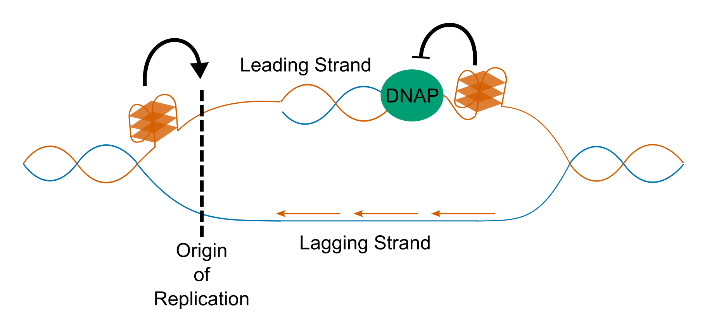

# Introduction

## The G-Quadruplex

### What is a Quadruplex?

The genome is often referred to as the "blueprint" for life. This metaphor suggests a static set of instructions, which simply encodes data and does not change its form. In reality, however, chromosomes are highly dynamic structures which are able to undergo various covalent modifications to the DNA and proteins, as well as change topologies on a global and local scale. At the global level, changes in how the chromatin is packed result in the closing off or opening up of specific regions, changing the level of transcription of the genes contained within them. Genes which are far apart in sequence space can be brought together through looping to allow co-regulation. At the smaller scale, the DNA itself is able to fold into a number of different shapes, including various types of duplex, triplex, and quadruplex. Examples include B-DNA (the classic double helix), A-DNA (duplex), R-loops (triplex), i-motifs (quadruplex) and G-Quadruplexes. These structures have different relative stabilities depending on the conditions of their local environment, e.g. the local concentration of solutes, complementary RNAs, or stabilising proteins, the level of molecular crowding, or the intracellular pH. Furthermore, some structures form only in DNA containing specific sequence attributes, such as high GC content. Whilst non-B forms of DNA have been known to form *in vitro* for some time, it is only recently that evidence of their formation *in vivo*, and their effects on biological systems, has begun to accumulate.

One of the more well studied non-B DNA/RNA forms is the G-Quadruplex (G4). The properties of guanine which allow G4s to form were first hinted at by German chemist Ivar Bang in 1910, more than four decades before Watson, Crick and Franklin deduced the structure of the double helix (Bang, 1910). Bang noted that guanosine nucleotides in concentrations of around 25mg/ml will form a viscous gel. It was not until 1962, however, that Gellert et al. were able to use the technique of X-ray diffraction to identify the interactions which caused this property. They noted that guanine monomers were able to interact to form square, planar quartets, which then stacked to form a helical structure (Gellert et al. 1962).

Many more recent studies have shown conclusively that far from being just an unusual property of monomeric guanine, square planar "G-quartets" can form from polymeric DNA, so long as it contains a high enough local concentration of guanines. The guanines in a quartet interact through non-canonical Hoogsteen base pairing, with two hydrogen bonds occuring between each adjacent base (i.e. each base participates in four hydrogen bonds, for a total of eight bonds per quartet) (Fig \ref{g4_struct}a). These quartets can then stack on top of one another through hydrophobic interactions (Fig \ref{g4_struct}b). The number of stacked quartets in a G4 is usually referred to as the number of tetrads. The stability of G4s is generally proportional to the number of tetrads they contains. Mono or divalent cations, usually potassium, fit into the central channel of the G4. These sit equidistant from each guanine of each quartet, and between each pair of adjacent tetrads. The number of potassium cations is one less than the number of tetrads, therefore (Fig \ref{g4_struct}b). Potassium is strongly stabilising of G4s, and so the stability of G4s is dependent upon potassium concentration.

The structure of G4s is highly polymorphic. Quadruplexes can form between multiple molecules (intermolecular) or from the same molecule (intramolecular). Intermolecular G4s tend to be less common *in vivo* than *in vitro* however as the effective concentration of G4 forming motifs *in vivo* is generally much lower than under experimental *in vitro* conditions. On top of this, G4s can fold with DNA strands in the same orientation (parallel), in different orientations (anti-parallel) or in a mixed hybrid conformation (Fig \ref{g4_struct} c). Which conformation is chosen is dependent upon the sequence from which the G4 is formed, as well as environmental conditions. The loops which connect the G-rich "pillars"   of the G4 can be connected laterally (resulting in anti-parallel conformation), diagonally (also anti-parallel) or through a "propeller" like fold (resulting in parallel strands). An anti-parallel G4 with only lateral loops is generally referred to as a "chair" like G4, whilst an anti-parallel G4 with a diagonal loop is referred to as "basket" like (Fig \ref{g4_struct} c). Many G4 forming sequences will fold into multiple conformations with different rates, resulting in two or more subpopulations of folded G4 from molecules of the same sequence.

\newpage


\newpage

{height=750px}

\newpage

### G-Quadruplex Prediction from Sequence

Genomic G4s form in sequences with high G4 content and high GC skew. Because of the dependence of G4 structure on sequence, it is theoretically possible to predict the genome-wide prevalence of G4s from sequence information alone, assuming that other conditions such as potassium concentration are held constant. The first attempt to characterise putative G4s (PG4s) at whole genome scale was conducted by Huppert and Balasubramanian in 2005. They formulated rules describing the general patterns that PG4 forming sequences tend to follow. Their first observation was that intermolecular G4s are unlikely to be common *in vivo* due to low strand concentration of the DNA. They also noted that the pillars of the G4 tended to be formed from contigous guanine homopolymers, or G-runs. There have to be four such G-runs in close proximity to create a PG4, and the length of the shortest G-run will determine the maximum number of stacked tetrads which can be formed. A minimum number of 3 tetrads was suggested for prediction: whilst 2 tetrad G4s are possible, they are less stable. Finally, they suggested that to make folding of the G4 favourable, the length of the loop sequences connecting the G-runs should be relatively short. They suggested, using evidence from molecular modelling and CD spectroscopy, an upper limit of 7bp. Again, whilst loops of much longer length are possible, they were thought likely to be unstable. Their observations were combined to create the folding pattern $G_XN_{1-7}G_XN_{1-7}G_XN_{1-7}G_X$, where $X \geq 3$. This was named the Quadparser method (Huppert and Balasubramanian 2005), and can be applied to search genomes using simple regular expression machinery.

The Quadparser method has been successfully used to identify G4s in many organisms, however the it is not perfect and results in many false negatives as well as false positives. Various adjustments can and have be made to the pattern, including increasing loop length to a maximum of 12bp, allowing two tetrad PG4s, and allowing short bulges in G-runs. These tend to increase the recall of the method but also greatly increase the number of false positives. Other methods have been proposed, such as G4Hunter (Bedrat et al. 2016), which allow PG4s to be given a numeric score based on the GC content and skew of the sequence. G4Hunter is generally performed using a sliding window between 20 and 40bp in length, and is evaluated for each window by the following method:

```python
score = 0
for base, run_length in run_length_encode(sequence):
    if base == 'G':
        score += min(run_length, 4) ** 2
    elif base == 'C':
        score -= min(run_length, 4) ** 2
    else:
        pass
score /= len(sequence)
```

Sequences which have high PG4 forming ability on the positive strand will therefore be given strong positive scores, whilst sequences with PG4 forming ability on the negative strand will be given strong negative scores. A threshold value is chosen below which to filter out non-PG4 forming sequences. Bedrat et al argued that this method was an improvement over the Quadparser technique because it was more flexible, however it also results in a much greater number of false positives when applied to a whole genome, since there are no constraints on how the G-runs are arranged in the windowed sequence.

\newpage

### Methods used in the characterisation of G-Quadruplexes

Gellert et al. first characterised G4 structure using X-ray diffraction of fibres from dehydrated guanine gels (Gellert et al. 1962). Since then, biophysical techniques have become key in the study of G4 structures *in vitro*. Since the advent of chemical DNA oligonucleotide synthesis in the 1980s, it has become relatively cheap to order high purity single stranded oligonucleotides for PG4 sequences, and produce micromolar concentration solutions which can be probed by CD spectroscopy or NMR.

Circular dichroism (CD) spectroscopy utilises the difference in absorbance of circularly polarised light by molecules with chiral structures (i.e. with non-superimposable mirror images). Parallel and anti-parallel G4s both exhibit unique CD absorbance spectra which are distinct from the spectra of disordered single stranded DNA. Solutions containing multiple subpopulations of different parallel and antiparallel G4s will produce spectra which are more complex to interpret, but are still clearly distinct from unordered DNA. Melting temperatures of G4s can be determined using CD or UV spectroscopy temperature gradients measured at 295nm.

Nuclear magnetic resonance spectroscopy (NMR), specifically Proton-exchange spectroscopy (1H-NMR), can also be used to identify G4 DNA. NMR is conducted in deuterated water, since deuterium has a spin of 1 and therefore does not contributed to the NMR spectrum. In single or double stranded DNA, imino protons in the guanine nucleotides will be exchanged with the solvent on short timescales, resulting in loss of the imino proton signal as they are replaced with deuterated protons. In G4 DNA, on the other hand, imino protons are located centrally within the G4 structure, and are therefore protected from exchange. This means that the 1H spectra can be used to distiguish . This does not however identify whether the G4 has parallel or anti-parallel topology. Further characterisation can be conducted using Nuclear Overhauser effect spectroscopy (NOESY) to identify spatial relationships between protons in the G4.

Finally, since folded G4s with short loops and flanking sequence are relatively globular, a number of G4 structures have been crystallised from oligomers. The structures of these crystals have then been solved by X-ray crystallography.

Studies of the structure of G4s has led to the development of a variety of G4-binding ligands. These have a wide range of structures and bind to the various G4 topologies with different strengths. The major classes of G4 binding ligands are: external stacking ligands, which have delocalised pi electron systems, and stack on the the hydrophobic surfaces of the outer G4 tetrads; intercalating ligands, which bind in the groove between stacked tetrads; and external groove binding ligands, which insert into the groove of the G4 helix, or interact with loop sequences (Chen et al 2014). Small molecules which bind G4s include: porphyrins, such as N-methyl-mesoporphyrin (NMM), an external stacking ligand; Pyridostatin, another external stacking molecule specifically designed for G4 binding; and Berberine, a naturally occuring alkaloid and G4 external stacking agent (Fig \ref{drugs}). These molecules have been used to study G4s *in vitro* and also *in vivo*.

\newpage

![**G-Quadruplex Stabilising Ligands** Structures and mode of action of Pyridostatin, NMM, and Berberine. Pyridostatin is thought to bind to all G4s equally well (Müller et al 2010), whilst NMM is known to prefer parallel G4s (Nicoludis et al. 2012). Berberine has been reported to bind to both parallel and anti-parallel G4s (Bazzicalupi et al. 2013, Li et al 2017). Crystal structures of human telomeric DNA (parallel G4 form) in complex with NMM and Berberine are from PDB entries 4FXM and 3R6R respectively (Nicoludis et al. 2012, Bazzicalupi et al. 2013). Potassium ions and solvent molecules have been hidden for visualisation purposes. \label{drugs}](figures/drugs.png)

\newpage

Whilst biophysical methods have led to a wealth of data on G4 formation *in vitro*, biological evidence of G4 formation has been a much later development. One common approach to studying the effect of G4 stabilisation on biological processes is to treat cells or organisms with G4 binding ligands such as NMM or pyridostatin. This has been shown to have various effects on replication, genome stability, transcription and development. Naturally fluorescent or fluorophore labelled small molecules are commonly used to localise G4s by microscopy, or study their *in vitro* folding by single molecule Förster resonance energy transfer (smFRET) (Maleki et al. 2017). Biotinylated pyridostatin has also been used to pull down G4 DNA structures from human DNA (Müller et al. 2010).

Moving beyond small molecules, Biffi et al developed an antibody which specifically recognises G4 DNA using synthetic phage display technology (Biffi et al. 2013). They used the antibody, named BG4, in immunofluorescence experiments to visualise G4s in human chromatin (Biffi et al 2013). More recently, it was used in Chromatin Immunoprecipitation sequencing (ChIP-seq) experiments to identify the specific regions of human chromatin where folded G4s occur (Hänsel-Hertsch et al. 2016).

A number of techniques have been employed for whole genome or transcriptome mapping of G4s. In a method they named G4-seq, Chambers et al. introduced potassium or pyridostatin into the buffer of Illumina sequencing-by-synthesis reactions (Chambers et al. 2015). This resulted in G4 formation in the single stranded DNA fragments, which caused stalling of DNA polymerase, resulting in sequencing errors. They conducted this method on single stranded DNA derived from the human genome. When they mapped the resulting reads to the genome, the number of sequencing errors in each position was considered an indicator of the G4 forming potential. Yoshida et al. also used a similar method to identify G4 clusters in human genomic DNA, by PCR amplifying sequences in the presence and absence of the G4 binding ligand telomestatin (Yoshida et al. 2018). They showed that regions which contained G4s were amplified with lower efficiency in the presence of telomestatin, due to polymerase stalling events. This resulted in a quantifiable reduction in the number of reads mapping to G4 containing regions of the genome in the drug positive samples, relative to the drug negative samples. G4s which form in RNA can also be mapped globally, using a technique called rG4-seq, developed by Kwok et al (Kwok et al 2016). This method again utilised stalling at G4s, in the presence of potassium or pyridostatin, this time by the RNA templated DNA polymerase Reverse transcriptase (RT). They identified positions in mRNAs where a reproducible drop in reads occurred in samples where RT mediated DNA synthesis was conducted in the G4 stabilising conditions, relative to unstabilised controls.

\newpage

## Biological Roles of G-Quadruplexes

### Genome Stability & DNA Replication

The distribution of G4s in genomes has been predicted from sequence for a wide variety of organisms, and has been experimentally determined by the techniques mentioned above for the human genome. There is conclusive evidence that G4s are not uniformly distributed throughout genomes, but tend to be clustered at functional locations. By far the strongest enrichment of G4s is seen at telomeres. G4s are also found more than would be expected in origins of replication, gene promoters, and inside gene bodies, particularly the 5' and 3' untranslated regions (UTRs). In these locations, it has been demonstrated that G4 formation has effects on the processes of DNA replication, genome stability, transcription, and translation.

Telomeres are the protein-DNA structures found at the ends of linear eukaryotic chromosomes. They consist of thousands of tandem repeats of a G-rich sequence (Moysis et al. 1998), with a single stranded overhang of around 100-200bp (Makarov et al. 1997). Due to functional limitations in templated DNA replication, the very ends of these cannot be duplicated during cell division. This means that without intervention, the chromosome will gradually shorten with each division. Telomeres therefore serve as protective caps that prevent the loss of important coding DNA from the genome. In humans, the telomeric repeat is (TTAGGG)n (Moysis et al. 1998). This has been identified through various methods as a G4 forming sequence.

Telomeres are coated in architectural proteins, called telomere end binding proteins (TEBPs), which protect the DNA from recognition by DNA damage response pathways. Giraldo & Rhodes showed that a yeast TEBP, RAP1, induces formation of G4 structures in telomeres *in vitro* (Giraldo & Rhodes, 1994). More recently, immunofluorescence experiments using the BG4 antibody showed that G4 foci overlap with fluorescent foci produced by Fluorescent *In Situ* Hybridisation (FISH) of the telomeric repeat in human HEK 293T cells (Moye et al. 2015). These results suggest that telomeric sequences do form G4s *in vivo*, which may be bound and stabilised by TEBPs. Furthermore, Moye et al. identified that telomerase, the template-independent DNA polymerase which synthesises new telomeric repeats, is able to bind to and partially unwind parallel G4s, but not anti-parallel G4s (Moye et al. 2015). There is therefore the suggestion of a G4 regulated mechanism for telomere maintainence.

G4s seem to also play roles in other aspects of DNA replication. It is well documented that G4s are capable of stalling polymerases *in vitro*. There is also growing evidence that without the assistance of G4 unwinding helicases, G4s might cause polymerase stalling *in vivo*, also. Work by Rodriguez et al. demonstrated that treatment of human cancer cells with pyridostatin causes an increase in the DNA damage marker γH2AX, suggesting an increase in double strand breaks (DSB). This damage was ameliorated by treatment with a DNA replication inhibitor, suggesting the damage was caused during replication. This is likely to be the result of replication fork collapse at G4 DNA blockages. The DNA helicase FANCJ, which is a tumour-suppressor gene often mutated in breast and ovarian cancers, is involved in DSB repair and has been shown to preferentially bind and unwind G4s (Wu & Spies, 2016). Mutation of the FANCJ ortholog DOG1 in *C. elegans* results in genome instability, and accumulation of deletions upstream of G4s (Kruisselbrink et al. 2008). 

In humans, DNA replication occurs from tens to hundreds of thousands of origins of replication which are found at regular distances of around 10-100kb apart (Huberman and Riggs 1968, Besnard et al. 2012). Using genome-wide mapping of replication origins by short nascent strand sequencing, Besnard et al. identified that the majority of human origins were in GC rich regions of DNA, and that 67% overlapped with motifs conforming to the Quadparser pattern (Besnard et al. 2012). 91% of origins were associated with G4s with loop length of up to 15bp. Furthermore, they found an association between the number of G4 motifs, and the strength of usage of origins, suggesting that G4s might be a recruiting factor for replication machinery.

\newpage



\newpage

### Transcription

Transcription is the process by which DNA is copied into messenger RNA (mRNA) or non-coding RNA (ncRNA), by a DNA-templated RNA polymerase. In eukaryotic systems, all mRNA is transcribed by RNA Polymerase II (Pol II). Initiation of transcription is often catalysed by general or specific transcription factors which bind to the promoter region, upstream of the transcriptional start site (TSS). Human promoter sequences are enriched for PG4 motifs conforming to the Quadparser motif (Huppert and Balasubramanian, 2007, Eddy & Maizels 2006). Tumour suppressor genes have fewer promoter PG4s than might be expected by chance, whilst proto-oncogenes contain more than might be expected (Eddy & Maizels 2006). These also overlap with regions of open chromatin, detected by methods such as DNase Hypersensitivity sequencing (DNase-seq) or Assay for Transposable-Accessible Chromatin by Sequencing (ATAC-seq), suggesting they are often actively transcribed (Huppert and Balasubramanian, 2007). Hänsel-Hertsch et al. used the BG4 antibody to perform ChIP-seq of G4 structures in conjunction with ATAC-seq and RNA-seq, in normal human keratinocytes and an immortalised cell line. They found that BG4 peaks were indeed associated with open promoters, and were found upstream of expressed genes (Hänsel-Hertsch et al. 2016). Interestingly, many more BG4 peaks were identified in the immortalised cells than in normal cells, despite having similar levels of open chromatin. Furthermore, genes which only had a promoter BG4 peak in the immortalised cells tended to be more highly expressed in those cells compared to the normal cells, suggesting that promoter G4s may increase gene expression. This increase in expression may be the result of recruitment of positive transcription factors.

Perhaps the most well studied promoter G4 is the Nuclease Hypersensitive Element III (NHEIII) found in the promoter of the c-MYC oncogene. The NHEIII contains a number of G-rich tracts which have been shown to form G4s *in vitro* by a variety of methods (Simonsson et al. 1998, Siddiqui-Jain et al. 2002, Seenisamy et al. 2004, Ambrus et al. 2005). Formation of a G4 by this region has a strongly repressive effect on gene expression. Siddiqui-Jain et al. found that treatment of cells with the G4 stabilising agent TMPyP4 led to repression of c-MYC, whilst G4 abolishing mutations in a c-MYC promoter luciferase assay caused a three-fold increase in expression (Siddiqui-Jain et al. 2004). Furthermore, Grand et al. identified that ~30% of human colorectal tumours have G->A transitions which abolish G4 forming potential *in vitro* (Grand et al. 2004). This was associated with increased expression, indicating that promoter G4s are key in regulation (and mis-regulation) of c-MYC. Pull-down of NHEIII binding factors by González et al. identified Nucleolin as a potential G4 interacting partner (González et al. 2009). Nucleolin is a multi-functional protein implicated in ribosome synthesis, transcription and chromatin remodelling. González et al. went on to show that Nucleolin binds to the c-MYC promoter *in vivo*, and that nucleolin overexpression results in downregulation of c-MYC gene expression.

G4s which form within the gene body may have differing effects on transcription, depending on the strand they occur in. Analysis of human gene expression data has suggested that genes containing coding strand G4s downstream of transcriptional start sites tend to have higher expression at the mRNA level than those that do not (Du et al. 2008), even when other factors such as gene function are controlled for. It has been speculated that G4 formation competes with double stranded DNA, creating single stranded "bubbles" which promote Pol II binding and transcription (Rhodes & Lipps 2015). Since the coding strand is not-directly used by Pol II, coding strand G4s will not cause polymerase stalling. G4s which form in the template strand, however, may form blockages which could slow or pause the progression of Pol II.

Transcription progresses by using the template strand as an antisense copy to replicate the coding strand sequence in mRNA. G4s which form in the template strand of gene body DNA will therefore need to be resolved before Pol II can move through them. Due to the relative stabilities of dsDNA and G4s, G4 formation may only occur in the gene body after a pioneering round of transcription, during which the DNA is in single stranded form. Rodriguez et al. showed that some of the DNA damage caused by treating cells with pyridostatin was transcription-dependent, and could be ameliorated by treating cells additionally with an inhibitor of transcription (Rodriguez et al. 2012).

Methods for estimating Pol II elongation rates across genes, such as GRO-seq or BruDRB-seq, have associated changes in speed with various features such as specific histone modifications, exon density, and sequence features. Veloso et al. correlated elongation rates from BruDRB-seq data with GC content of genes, and found that genes with higher GC content tended to have slower elongation (Veloso et al. 2014). They hypothesised that this could be due to the greater stability of GC-rich duplexes, which have extra hydrogen bonds. It is also possible, however, that this effect could be partially due to greater numbers of G4s in GC-rich genes.

In human cells, profiling of Pol II occupancy by ChIP-seq has demonstrated that there is a large peak of paused polymerase in the first 30-60bp downstream of the TSS (Jonkers & Lis 2015). This pausing is an important checkpoint ensuring Pol II is correctly modified before elongation begins. Genes which require large and rapid increases in expression in response to environmental stresses, such as heat shock proteins, also have large amounts of paused Pol II which can be activated quickly. During initiation of transcription, Pol II is recruited to the TSS by specific or general transcription factors, and transcribes for a short distance before becoming paused. Formation of paused Pol II, referred to as the Pre-Initiation Complex (PIC), is stabilised by the Negative elongation factor (NELF) and DRB-sensitivity-inducing factor (DSIF), as well as by phosphorylation of the carboxy-terminal domain (CTD) of Pol II at Serine 5. Productive elongation can then be restarted by the action of the positive transcription elongation factor-b (P-TEFb) complex, which phosphorylates NELF and DSIF, causing the former to be released from the PIC, and the latter to switch to becoming a positive elongation factor. P-TEFb also phosphorylates the CTD at Serine 2, which is considered a hallmark modification of active Pol II. How Pol II pausing is regulated is still not clear (Jonkers & Lis 2015, Liu et al. 2015). One hypothesis is that the sequence content of promoters and promoter proximal regions may be important for regulating pausing. A number of promoter motifs, such as the GAGA motif or the downstream promoter element (DPE) have been associated with promoters with high levels of stalling (Hendrix et al. 2008).

It is well established that the promoter proximal regions of genes in many organisms have, on average, higher GC content than the rest of the gene body (Veloso et al. 2014). Eddy et al. identified that the first 200bp downstream of the TSS tends to be more GC-rich in genes with high levels of proximal pausing than in genes which do not exhibit pausing (Eddy et al. 2011). The G4-forming potential of these genes also tended to be greater on the coding strand, meaning that G4 structures might also form in the nascent mRNA. Eddy et al. hypothesised that these 5' mRNA G4s might signal back to the polymerase to produce pausing. A similar mechanism involving an RNA hairpin has been implicated in pausing of *E coli* RNA Polymerase (Toulokhonov et al. 2007).

The enrichment of G4s in promoters and promoter proximal regions suggests that proteins involved in transcriptional complexes may bind specifically to these structures. The general transcription initiation factor complex, TFIIH, contains 11 subunits, and is required for both transcriptional processes and DNA repair through the Nucleotide Excision Repair (NER) pathway (Compe & Egly, 2012). The DNA helicases XPB and XPD are essential components of TFIIH, which catalyse the denaturation of DNA in promoters or around lesions (Coin et al. 2007). Through *in vitro* binding assays, Gray et al. identified XPB and XPD as G4 interacting proteins, which bind G4s preferentially over dsDNA (Gray et al. 2014). XPD was also found to unwind G4s *in vitro*. Gray et al. went on to perform ChIP-seq of XPD and XPB, and showed that it was enriched at TSS loci containing G4s. Approximately 40% of XPD/XPB peaks contained PG4s conforming to the Quadparser pattern (with loop lengths >= 12bp). Furthermore, Hänsel-Hertsch et al. also reported a strong overlap between these XPD/XPB peaks and G4 loci observed by BG4 ChIP-seq (Hänsel-Hertsch et al. 2016). This suggests that TFIIH may be recruited to G4 containing promoters to initiate transcription.

\newpage

### mRNA Processing

Nascent pre-mRNA which is newly transcribed by Pol II must undergo 5' capping, splicing, RNA modification, poly-adenylation and quality control before it can mature into mRNA which is exported to the cytoplasm. Many of these processes occur co-transcriptionally and are tightly co-ordinated to prevent mistakes. Multiple independent studies in different organisms estimate that between 75%-85% of splicing is conducted in a cotranscriptional manner (Armour et al. 2011, Khodor et al. 2011, Girard et al. 2012, Tilgner et al. 2012, Windhager et al. 2012). Oesterreich et al. found that in yeast, 10% of intron splicing is complete when Pol II is only 26bp downstream of the intron acceptor site, and 50% complete when Pol II is 45bp downstream. (Oesterreich et al. 2016). By modifying Pol II to increase its speed 2.3x, they also showed that splicing could become rate limiting when elongation rate is greater. Furthermore, modifications to splice site sequences in a reporter reduced the rate of splicing, presumably by reducing the strength of recognition by snRNAs, and thereby the rate of spliceosome assembly (Oesterreich et al. 2016). This indicates that interplay of splice site strength and Pol II elongation speed determine the relative efficiency of splicing.

It has been estimated that greater than 90% of human genes undergo some form of alternative splicing (Wang et al. 2008). During this process, different donor and acceptor sites compete to be utilised. The most common form of alternative splicing is alternate donor or acceptor usage, where the other site used is constitutive. Other forms include intron retention, where splice sites are simply not used at all, or exon skipping, where constitutive donor and acceptor sites are paired such that an intervening exon is removed from the mature mRNA. Regulation of alternative splicing can occur via protein splicing factors, as well as through changes in Pol II elongation speed.

\newpage

### mRNA Stability and Translation

\newpage

### Chromatin Remodelling

