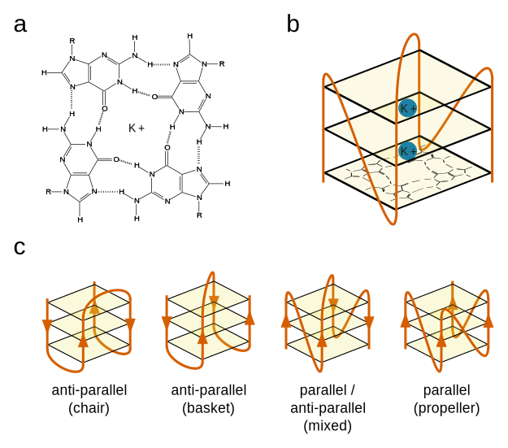

# Introduction

The genome is often referred to as the "blueprint" for life. This metaphor suggests a static set of instructions, which simply encodes data and does not change its form. In reality, however, chromosomes are highly dynamic structures which are able to undergo various covalent modifications to the DNA and proteins, as well as change topologies on a global and local scale. At the global level, changes in how the chromatin is packed result in the closing off or opening up of specific regions, changing the level of transcription of the genes contained within them. Genes which are far apart in sequence space can be brought together through looping to allow co-regulation. At the smaller scale, the DNA itself is able to fold into a number of different shapes, including various types of duplex, triplex, and quadruplex. Examples include B-DNA (the classic double helix), A-DNA (duplex), R-loops (triplex), i-motifs (quadruplex) and G-Quadruplexes. These structures have different relative stabilities depending on the conditions of their local environment, e.g. the local concentration of solutes, complementary RNAs, or stabilising proteins, the level of molecular crowding, or the intracellular pH. Furthermore, some structures form only in DNA containing specific sequence attributes, such as high GC content. Whilst non-B forms of DNA have been known to form *in vitro* for some time, it is only recently that evidence of their formation *in vivo*, and their effects on biological systems, has begun to accumulate.

One of the more well studied non-B DNA/RNA forms is the G-Quadruplex (G4). Incredibly, the properties of guanine which allow G4s to form were first hinted at by German chemist Ivar Bang in 1910, more than four decades before Watson, Crick and Franklin deduced the structure of the double helix (Bang, 1910). Bang noted that guanosine nucleotides in concentrations of around 25mg/ml will form a viscous gel. It was not until 1962, however, that Gellert et al. were able to use the technique of X-ray diffraction to identify the interactions which caused this property. They noted that guanine monomers were able to interact to form square, planar quartets, which then stacked to form a helical structure (Gellert et al. 1962).

Many more recent studies have shown conclusively that far from being just an unusual property of monomeric guanine, square planar "G-quartets" can form from polymeric DNA, so long as it contains a high enough local concentration of guanines. The guanines in a quartet interact through non-canonical Hoogsteen base pairing, with two hydrogen bonds occuring between each adjacent base (i.e. each base participates in four hydrogen bonds, for a total of eight bonds per quartet) (Fig \ref{g4_struct}a). These quartets can then stack on top of one another through hydrophobic interactions (Fig \ref{g4_struct}b). The number of stacked quartets in a G4 is usually referred to as the number of tetrads. The stability of G4s is generally proportional to the number of tetrads they contains. Mono or divalent cations, usually potassium, fit into the central channel of the G4. These sit equidistant from each guanine of each quartet, and between each pair of adjacent tetrads. The number of potassium cations is one less than the number of tetrads, therefore (Fig \ref{g4_struct}b). Potassium is strongly stabilising of G4s, and so the stability of G4s is dependent upon potassium concentration.

The structure of G4s is highly polymorphic. Quadruplexes can form between multiple molecules (intermolecular) or from the same molecule (intramolecular). Intermolecular G4s tend to be less common *in vivo* than *in vitro* however as the effective concentration of G4 forming motifs *in vivo* is generally much lower than under experimental *in vitro* conditions. On top of this, G4s can fold with DNA strands in the same orientation (parallel), in different orientations (anti-parallel) or in a mixed hybrid conformation (Fig \ref{g4_struct} c). Which conformation is chosen is dependent upon the sequence from which the G4 is formed, as well as environmental conditions. The loops which connect the G-rich "pillars"   of the G4 can be connected laterally (resulting in anti-parallel conformation), diagonally (also anti-parallel) or through a "propeller" like fold (resulting in parallel strands). An anti-parallel G4 with only lateral loops is generally referred to as a "chair" like G4, whilst an anti-parallel G4 with a diagonal loop is referred to as "basket" like (Fig \ref{g4_struct} c). Many G4 forming sequences will fold into multiple conformations with different rates, resulting in two or more subpopulations of folded G4 from molecules of the same sequence.

Genomic G4s form in sequences with high G4 content and high GC skew. Because of the dependence of G4 structure on sequence, it is theoretically possible to predict the genome-wide prevalence of G4s from sequence information alone, assuming that other conditions such as potassium concentration are held constant. The first attempt to characterise putative G4s (PG4s) at whole genome scale was conducted by Huppert and Balasubramanian in 2005. They formulated rules describing the general patterns that PG4 forming sequences tend to follow. Their first observation was that intermolecular G4s are unlikely to be common *in vivo* due to low strand concentration of the DNA. They also noted that the pillars of the G4 tended to be formed from contigous guanine homopolymers, or G-runs. There have to be four such G-runs in close proximity to create a PG4, and the length of the shortest G-run will determine the maximum number of stacked tetrads which can be formed. A minimum number of 3 tetrads was suggested for prediction: whilst 2 tetrad G4s are possible, they are less stable. Finally, they suggested that to make folding of the G4 favourable, the length of the loop sequences connecting the G-runs should be relatively short. They suggested, using evidence from molecular modelling and CD spectroscopy, an upper limit of 7bp. Again, whilst loops of much longer length are possible, they were thought likely to be unstable. Their observations were combined to create the folding pattern $G_XN_{1-7}G_XN_{1-7}G_XN_{1-7}G_X$, where $X \geq 3$. This was named the Quadparser method (Huppert and Balasubramanian 2005).

